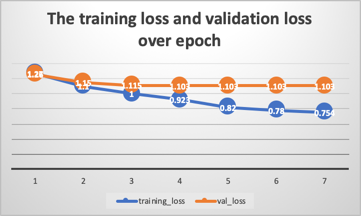

# Coursework on Deep Learning and Robotics (COMP34212)
- author: Eu-Bin KIM (10327741)

## 1. Introduction

What are we doing here?
- CIFAR dataset
- with a CNN
- optimization: 
  - epochs (with early stopping),
  - number of convolution layers (by comparing the testing acc. epochs are optimised wih early stopping for each.)   
  - with & without batch norm & dropout. 
- justification - summarize them here. (judging from the results... of course.)
- Pytorch is used instead of Keras as the author is more familiar with Pytorch than Tensorflow.

## 2. Literature review

{width=150px}

**Deep learning is widely used to tackle reasoning, embodiment and learning process of cognitive robotics**. As illustrated
in **Figure 1** above, the deep-learning-applicable challenges of robotic vision can be categorized (Sunderhauf et al., 2018) into three conceptual axes:
Reasoning, Embodiment and Learning.
- any examples?: do state any concrete examples.
  - 1. one example from Reasoning: 
  - 2. one example from Embodiment:
  - 3. one example from Learning:

**That is because... (the reason for deep learning being widely used...)**
- explain: essentially the "pros" of deep learning approach in cognitive robotics.
- - what's the invariant of all of the dimesions above? 
- (Pierson et al, 2017) "every part of a complex system can be made to learn." -> "connect parts of all of these structures together
    to form a full system that learns throughout". -> "when each part is capable of learning, the system
    as a whole can adapt in sophisticated ways."
- here, you essentially talk about the **pros** of deep learning in cognitive robotics.  
- and then... unanimously says... anything else? That's what I want to see here.
- examples?

**But applying deep learning does come with limits (the biggest shortcoming - large amount of data, but hard to obtain them), which could nevertheless be mitigated by ...()**.
- cons
  - "the necessity to acquire large amounts of data" (sunderhauf et al., 2018). - hard, because data requires interaction with the real world.
  - this echoes with "perhaps most significant is the volume of training data required" (Pierson et al., 2017). again, hard, becaus "generating training data on physical systems can be expensive."
    - (make sure that he cited these examples) e.g 1. It took Levine et al. 2 months to collect the data. 
    - e.g 2. Jain et al.: took them 10 different drivers to collect the data
- solution
  - but this could be mitigated: by using a **simulation** to generate the training data (Pierson et al., 2017).
    - e.g. Mariolis et al.
    - e.g. Kappler et al.
  
**A mixture of rule-based approach & deep learning approach seems to be the viable future of cognitive robotics.**
- reason: "there is a spectrum, rather than a dichotomy" (Sunderhauf et al., 2018).
- example?:

## 3. Methods

{width=300px}

**The architecture of the network.** After a series of hyper parameter explorations, we ended up with a 
CNN of the architecture above. 
- It is a CNN with three convolution layers and one fully connected layer at the end=. Each convolution layer is regularised with batch norm and dropout layers
- implemented with pytorch, as the author was more familiar with pytorch than with Keras.(answers the coding requirements.)
- it is composed of: conv layer, max pooling layer, batch norm layer and drop out layer. (what they ar)
- we use adam optimiser. the learning rate gradually decreases.\ 

**Four experiments have been done to optimise hyper parameters, feature values and   **. 
- Classifying images of Cifar10 dataset.
- exp 1: hyper parameter: optimising epochs
- exp 2: data normalised / unnormalised.
- exp 3: optimising the number of convolution layers
- exp 4: regularising the network with Batch norm and Dropout layers.

## 4. Results & Discussions
### 4.1. Experiment 1: Optimising epochs with early stopping

{width=300px}

**We optimise the number of epochs with Early Stopping technique.**
- why optmise epoch?:  too few = underfitting / too many = overfitting -> directly affects the performance.
- but then how do we do that? - Early Stopping technique (Geron, 2019); first set aside a validation set. Then on every end of epoch we evaluate
  the validation loss as well as training loss. We stop the training when the validation loss no longer improves.
- **Figure 3** above illustrates how we do this. (and.. explanation of the method.)
- this technique is applied to the rest of the experiments.

### 4.2. Experiment 2: Normalising the features

model | features unnormalised | features normalised | epoch
--- | --- | --- | ---
BaseCNN | 61.29%  | **63.12%** | 4

Table: The testing accuracies of the BaseCNN model with unnormalised features and normalised features. The number of
epoch is optimised for the model with Early Stopping.

**From Experiment 2, we see that normalising the feature values result in an increase in accuracy.**
- why? 
- evidence?: the table above.

### 4.3. Experiment 3: Optimising the number of convolution layers

model | training accuracy | testing accuracy | epoch   
--- | --- | --- | --- 
BaseCNN | 75.94% | 62.12% | 4
TwoCNN |  74.42% | **67.36%** | 8
ThreeCNN | 72.02% | 66.41% | 8

Table: The training and testing accuracies of the CNN's with different numbers of convolution layers.
The number of epochs for each model is optimised with Early Stopping.

**From Experiment 3, we see that adding more convolution layers does not always result in an increase in accuracy.**
- why? Adding unne
- BaseCNN has 1 convolution layer, TwoCNN has two, and ThreeCNN has three.  
- We see this from the table above.

### 4.4. Experiment 4: Regularising the network

model |training accuracy | testing accuracy | epoch
--- | --- | ---
RegBaseCNN | 71.155% | 59.73% | 3
RegTwoCNN | 76.6625% | 69.3% | 9 
RegThreeCNN | 78.78% | **71.2%** | 17

Table: The training and testing accuracies of the regularised CNN's.  The number of epoch for each model
is optimised with Early Stopping.

**From experiment 4, we see that adding Batch norm and Dropout layers significantly improves the performance.** 
- They are regularised with  Bath norm and Dropout layers added to each convolutional layer.

### 4.5. Discussion

**We could further improve the model either by extending vanilla CNN or adopting a more sophisticated architecture.**
- vgg: extending vanilia CNN. adding more layers. (link back to experiment 2. with careful)
- resnets : introduced residual blocks.
- or, just last year: applied transformer (convetionally used more in NLP for modeling sequences). in the classifying images.

## 5. References

- Pierson et al., 2017.
- Sunderhauf et al., 2017
- Geron, 2019 (hands-on ML.)
- VGG: Simonyan et al. in Very Deep Convolutional Networks for Large-Scale Image Recognition
- Resnet: He et al. in Deep Residual Learning for Image Recognition
- vit: Dosovitskiy et al. in An Image is Worth 16x16 Words: Transformers for Image Recognition at Scale
