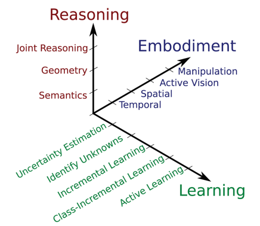

# Coursework on Deep Learning and Robotics
- author: Eu-Bin KIM (10327741)

## Introduction

A clear introductory to the problem and the methodology to be used, with justification of the network topology and hyperparameters chosen (3)

What are we doing here?
- CIFAR dataset
- with a CNN
- optimization: 
  - epochs (with early stopping),
  - number of convolution layers (by comparing the testing acc. epochs are optimised wih early stopping for each.)   
  - with & without batch norm & dropout. 
- justification - summarize them here. (judging from the results... of course.)
- Pytorch is used instead of Keras as the author is more familiar with Pytorch than Tensorflow.
---

## Literature review (8)

Contextualisation and state of the art in robotics and deep learning (marks given for
clarity/completeness of the overview of the state of the art, with spectrum of deep learning
methods considered in robotics; critical analysis of the deep learning role in robotics; quality
of the references cited)

> the spectrum of deep learning methods considered

**Deep learning (e.g. the CNN above) is widely used to tackle challenges in cognitive robotics**. As illustrated
in **Figure 1** above, the deep-learning-applicable challenges of robotic vision can be categorized into three conceptual axes:
Reasoning, Embodiment and Learning (Sunderhauf et al., 2018).
- any examples?: do state any concrete examples.
  - 1. one example from Reasoning: 
  - 2. one example from Embodiment:
  - 3. one example from Learning:

and.. what is the invariant of all the examples above?

> Now, why is deep learning widely used then?; what's the role of deep learning in cognitive robotics? (overview)

**That is because... (...)**
- explain: essentially the "pros" of deep learning approach in cognitive robotics.
- (Pierson et al, 2017) "every part of a complex system can be made to learn." -> "connect parts of all of these structures together
    to form a full system that learns throughout". -> "when each part is capable of learning, the system
    as a whole can adapt in sophisticated ways."
- and then... unanimously says... anything else? That's what I want to see here.
- examples?

> critical analysis: What's the pro's and con's of applying deep learning to cognitive robotics?

**But applying deep learning does come with limits (the biggest shortcoming - large amount of data, but hard to obtain them), which could nevertheless be mitigated by ...()**.
- cons
  - "the necessity to acquire large amounts of data" (sunderhauf et al., 2018). - hard, because data requires interaction with the real world.
  - this echoes with "perhaps most significant is the volume of training data required" (Pierson et al., 2017). again, hard, becaus "generating training data on physical systems can be expensive."
    - (make sure that he cited these examples) e.g 1. It took Levine et al. 2 months to collect the data. 
    - e.g 2. Jain et al.: took them 10 different drivers to collect the data
- solution
  - but this could be mitigated: by using a **simulation** to generate the training data (Pierson et al., 2017).
    - e.g. Mariolis et al.
    - e.g. Kappler et al.

> verdict: where will this lead to?

**A mixture of rule-based approach & deep learning approach seems to be a viable path in cognitive robotics.**
- reason: "there is a spectrum, rather than a dichotomy" (Sunderhauf et al., 2018).
- example?: 

---

## Methods (7)

Complexity of the network(s), hyperparameters and dataset (marks given for complexity
and appropriateness of the network topology; hyperparameter exploration approach; data
processing and coding requirements)

### The Final network structure

### 

> just state the

## Description  (12)

- justification goes here.

Description, interpretation and assessment of the results on the hyperparameter testing
simulations, including appropriate figures and tables to support the results (marks given for
the clarity of the reporting of the simulations done and the results presented via
text/tables/charts; Depth of the interpretation and assessment of the quality of the results;
Discussion of alternative/future simulations to complement the results obtained); Marks
lost if report longer than the required maximum of 5 pages.

> Include a discussion - how could you improve upon what you currently have?

### optimising epochs

(a figure showing when this should be stopped.)

early stopping - we could do this.. right? Just do this by hand... and as for the other parts..
- cite early stopping? (Hands-on ML with tensorflow)

### optimising the number of convolution layers

one | two | three
-- | --- | ---
... | ... | ...

### Regularizing the models with batch-norm and dropout layers.

---

## References

- Pierson et al., 2017.
- Sunderhauf et al., 2017

