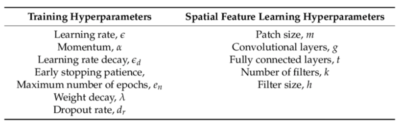

## 5th of March 2021

First commit. 

What am I supposed to do with the notebooks?

Gotta go check the the video now.

## 9th of May, 2021

oh my god, two months later?

Let's actually do some work here.

You will be researching on state of the art of cognitive robotics.
You'd have...

## 10th of May, 2021

Using pytorch. I don't have to use keras. since, we are not submitting any code.
- this tutorial might come in handy (한국인)- https://tutorials.pytorch.kr/beginner/blitz/cifar10_tutorial.html
- also, from the official pytorch documentation: - https://pytorch.org/tutorials/beginner/blitz/cifar10_tutorial.html

approach
 - CNN + CIFAR. Confine your choices, and optimise.

the point of this lab is optimsing the model, really.
That's what you have to do.

## 15th of May 2021

the training simulations:
1. implement early stopping. This is necessary.
2. Then what? what do I optimise? the number of layers?

> What hyper parameters are there for CNN?

- Convolutional layers - how many layers do I need?
- dropout rate - we are implementing this, for sure.
  - first, with and without dropout
  - second, the accuracy over the dropout.
- stick to the accracy as the evaluation metric. I simply won't have time for
- maximum number of epochs (early stopping) - do this as the last step.

sequentially defining the model architecture:
- https://www.analyticsvidhya.com/blog/2019/10/building-image-classification-models-cnn-pytorch/

SO, what we'll be testing for is...
- 1 conv layer, 2 conv layer, 3 conv layer and 4 conv layer.
  - just train them, save the models somewhere, and evaluate them with another script.
  